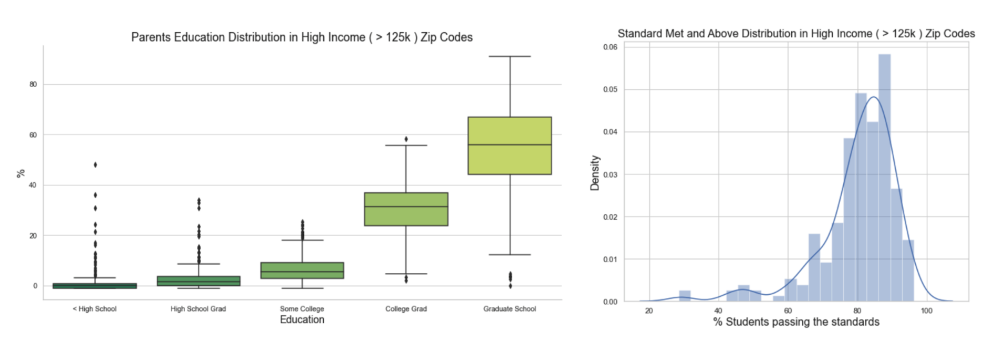
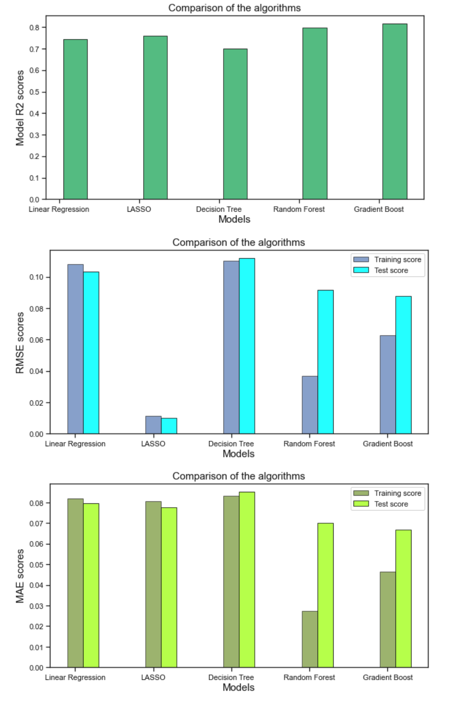
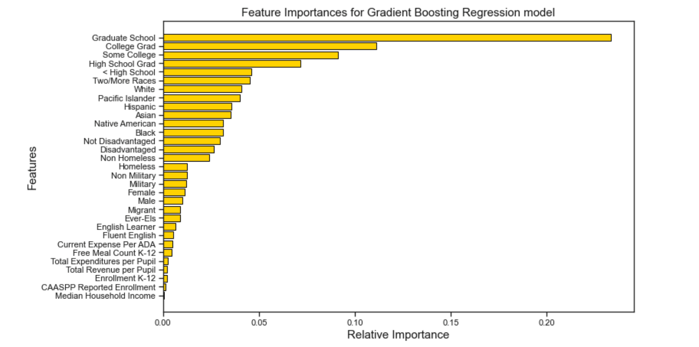

# Passing the Standards Projection

Research shows that high-poverty areas disproportionally educate children of color. The chances of ending up in a high-poverty or high-minority school are highly determined by a student’s race/ethnicity and social class. For instance, African American and Hispanic students—even if they are not poor—are much more likely than White or Asian students to be in high-poverty schools.

There is a growing body of evidence that shows increased investment on education returns better outcomes and that the positive effects are even greater among low-income students. On the other hand, it costs more to educate low-income students and provide them with a robust education capable of overcoming their initial disadvantages.

**Goals:**

- Understand the current demographics of wealthy to high-poverty schools across the state of California.
- Identify how much funding is available per pupil in wealthy vs high-poverty areas.
- Learn what factors are most correlated with student performance.
- Create a predictive model to find the percentage of students passing the standards per school.

## 1. Data
[Data Wrangling Report](https://github.com/gabriellewald/education-project/blob/main/Capstone1_data_wrangling.ipynb)

The dataset for this project is unique. It has been constructed using several datasets from the California Department of Education and the National Center of Education Statistics. It concerns with California K-12 public education for the academic year of 2018-2019.

- [California Assessment of Student Performance and Progress](https://caaspp-elpac.cde.ca.gov/caaspp/ResearchFileList?ps=true&lstTestYear=2019&lstTestType=B&lstCounty=00&lstDistrict=00000&lstSchool=0000000)

    - Extracted data at school level keeping demographic information and percentage of students meeting the standards per school.
    - Two datasets were created, one for language arts and literature and one for mathematics.
    - All the demographic information was contained in one column called subgroup ID, the data was reorganized to contain one feature per column and one observation per row.
    - The final dataset contains number of students per demographic feature and one school per row.

- [California Median Household Income](http://www.usa.com/rank/california-state--median-household-income--zip-code-rank.htm?yr=9000&dis=&wist=&plow=&phigh=)

    - Merged with assessment data via zip code. 

- [Current Expense Per Daily Attendance](https://www.cde.ca.gov/ds/fd/ec/currentexpense.asp)

    - Merged with assessment data via district code.

- [Total Revenue, Total Revenue per Pupil and Total Expenditure](https://nces.ed.gov/ccd/elsi/default.aspx?agree=0)

    - Used string manipulation to remove punctuation and capitalize letters in order to merge with the assessement dataset via district name.

- [Free or Reduced Price Meals](https://www.cde.ca.gov/ds/ad/filessp.asp)

    - Merged with assessment data via school code.

## 2. Data Cleaning
[Data Cleaning Report](https://github.com/gabriellewald/education-project/blob/main/Capstone1_data_cleaning.ipynb)

- Updated data types to integer, string or float as appropriate.
- Created dummy columns to signal missing values, adding more weight to original data.
- Differentiate NaNs from other missing values. Some analysis showed that NaN was zero; for other missing values -1 was imputed to keep the highest number of observations as possible.
- Transformed number of students to percentage of students in several feature columns to keep the same format as the response variable.
- Imputed the median for a few features with missing values, as appropriate.

## 3. EDA
[Exploratory Data Analysis Report](https://github.com/gabriellewald/education-project/blob/main/Capstone1_exploratory_data_analysis.ipynb)

**Overall distribution:**

- There is a higher proportion of disadvantaged students across K-12 public schools in CA (left skewed distribution).
- CA is a minority-majority state with a higher percent of students self-identifying as Hispanic.

An in-depth investigation of income distribution showed:

- HIGH INCOME (> 125k)
    - There is a higher percentage of students passing the standards (left skewed distribution).
    - Parents are much more likely to have completed a four year college or higher.
    - The most common degree achieved by parents in this income bracket is graduate school.
    - The most common ethnicities are White and Asian.

    
- LOW INCOME (< 30K)
    - There is a lower percentage of students passing the standards (slight right skewed distribution).
    - Parents are more likely to have completed only high school or be drop-outs.
    - The most common level of education is less than high school or high school graduate.
    - Hispanic is the most common ethinicity in this income bracket.

**Pairwise relationship:**

Strong linear relationship found between the dependent variable "PERCENTAGE OF STUDENTS PASSING" and the following independent variables:

- Socioeconomic status
    - As the percentage of students from disadvantaged status increase, the percentage of students passing the standards decrease.
- Parents Education
    - < High School and High School Grad: As the percentage of students whose parents education falls in this category increases, the number of students passing the standards decrease.
    - College Grad and Graduate School: As the percentage of students whose parents education falls in this category increases, the number of students passing the standards also increases.
- Median Household income
    - As median household income increases, so does the percentage of students passing the standards.
 

## 4. Machine Learning Models
[Pre Processing and Modeling Report](https://github.com/gabriellewald/education-project/blob/main/Capstone1_pre_processing_training.ipynb)

In order to predict the proportion of students passing standards in California K-12 public schools, here I have considered 31 features, either directly from the dataset or engineered/derived from the data. The most important ones in terms of relative importances are parents' level of education, students ethinicity (this might hint cultural and background differences) and socioeconomic status.

The response variable is numerical and represents a proportion of the total students per school. Here, this is treated as a Regression problem since the response variable is numerical. Nonetheless, there is no ideal model to predict proportions.

Here I have used the following Regression models:

- Linear Regression
- LASSO
- Decision (Regression) Tree
- Random Forest
- Gradient Boosting

Each model is evaluated using several metrics. For this project mean absolute error (MAE), root-mean square error (RMSE) and R-squared (R2) were chosen to measure model accuracy. R2 was plotted for test data, and MAE and RMSE were plotted for training and test data. 

Gradient Boosting, an ensemble method based on decision trees, is the best performing model  with r-squared equals to 81.5.

Gradient Boosting Feature Importance:

>*NOTE: In RMSE the errors are squared before they are averaged giving the RMSE a higher weight to >large errors. Thus, the RMSE is useful when large errors are undesirable. The >smaller the RMSE, the more accurate the prediction because the RMSE takes the square >root of the residual errors of the line of best fit.*

## 6. Conclusion

Evaluating the performance of a model by training and testing on the same dataset can lead to the overfitting. The model evaluation is based on splitting the dataset into train and validation set. But, the performance of the prediction result depends upon the random choice of the pair of train, test set. In order to overcome that, the Cross-Validation procedure is used where under the k-fold CV approach, the training set is split into k smaller sets, where a model is trained using k-1 of the folds as training data and the model is validated on the remaining part.

