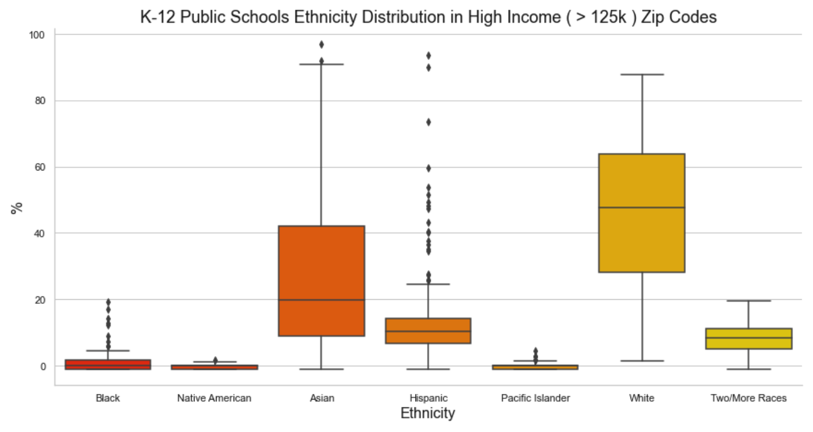

# Predicting Test Performance in California Public Schools

### In-depth investigation of factors associated with student test performance

**Problem Statement:**

Research shows that high-poverty areas disproportionally educate children of color. A student’s race/ethnicity and social class are highly predictive of whether they will attend a high-poverty or high-minority school. For instance, African American and Hispanic students—even if they are not poor—are much more likely than White or Asian students to be in high-poverty schools. There is a growing body of evidence that shows that increased investment in education leads to better outcomes and that the positive effects are even larger among low-income students. On the other hand, it costs more to educate low-income students and provide them with a robust education capable of overcoming their initial disadvantages. There is a strong need to find more informed and granular causes that impact test achievement in schools. This investigation seeks to understand what other factors are associated with student performance and ultimately predict the proportion of students in each school that pass standardized tests.

**Objectives:**

- Understand the current demographics of wealthy to high-poverty schools across the state of California.
- Learn what factors are most correlated with student performance (pass rate).
- Create a predictive model to find the proportion of students passing standard tests per school.

**Beneficiaries:**

- School administrators and policy makers to effectively identify schools that need more support and allocate resources to address tutoring needs, mentoring, and extracurricular activities.
- Teachers can be oriented to provide more support for under-performing groups and reduce achievement gaps.
- From a parents perspective, the results can be used to select a high performing school that meets academic standards.
- Department of education/ federal government to gain insights and potentially innovate adult (parents) education.

## 1. Data Acquisition
[Data Wrangling Report](https://github.com/gabriellewald/education-project/blob/main/notebooks/1_data_wrangling.ipynb)

The dataset for this project is unique. It has been constructed using several publicly available data files regarding the academic year of 2018-2019. The files come from the California Assessment of Student and Progress (CAASPP), California Department of Education (CDE), and the National Center of Education Statistics (NCES). The assessment data refers to the Smarter Balanced Summative Assessment, a standardized test applied yearly to K-12 students of public schools in California. It contains student demographic information, and the response variable of interest (number of students who meet the standards per school). The other datasets include variables such as current expense per daily attendance, number of students per school receiving free or reduced price meals, total revenue and expenditure per pupil, and median household income per zip code.

- California Assessment of Student Performance and Progress (CAASPP)
    - Extracted data at school level keeping demographic information and percentage of students meeting the standards per school (response or target variable).
    - All the demographic information was contained in one column called subgroup ID, this data was remapped to create one feature per column.

- California Departament of Education (CDE)
    - Current expense per daily attendance merged with assessment data via district code.

- National Center for Educational Statistics (NCES)
    - Total Revenue and Total Expenditure per pupil.
    - Used string manipulation to remove punctuation and capitalize letters in order to merge to the assessement dataset via district name.

- California Median Household Income
    - Merged with assessment data via zip code.

## 2. Data Cleaning
[Data Cleaning Report](https://github.com/gabriellewald/education-project/blob/main/notebooks/2_data_cleaning.ipynb)

- Imputed missing values with the median or zero as appropriate.
- Created dummy columns to signal missing values.
- Updated data types to integer, string or float as appropriate.
- Transformed number of students to percentage of students in several feature columns to keep the same format as the response variable.

## 3. Exploratory Data Analysis
[Exploratory Data Analysis Report](https://github.com/gabriellewald/education-project/blob/main/notebooks/3_exploratory_data_analysis.ipynb)

[Hypothesis Testing Report](https://github.com/gabriellewald/education-project/blob/main/notebooks/4_hypotheses_testing.ipynb)

The data is explored to find trends, insights, and potential outliers based on visualization and hypothesis testing. These graphs and figures are important communication tools for collaborating in data science teams or presenting to business-oriented customers. The libraries used were matplotlib, seaborn, and pandas. 

**Distribution:**

- There is a higher proportion of disadvantaged students across K-12 public schools in CA (left skewed distribution).
- CA is a minority-majority state with a higher percent of students self-identified as Hispanic.

**Income, Education & Ethnicity**

- HIGH INCOME (> 125k)
    - There is a higher percentage of students passing the standards (left skewed distribution).
    - The most common degree achieved by parents in this income bracket is graduate school.
    - The most common ethnicities are White and Asian.
 

 

    
- LOW INCOME (< 30K)
    - There is a lower percentage of students passing the standards (slight right skewed distribution).
    - The most common level of education for parents in this income bracket is less than high school.
    - Hispanic is the most common ethinicity.
   

**High Correlation between Dependent and Independent Variables:**
- Socioeconomic status
    - As the percentage of students from disadvantaged status increase, the percentage of students passing the standards decrease.
- Parents Education
    - < High School and High School Grad: As the percentage of students whose parents education falls in this category increases, the number of students passing the standards decrease.
    - College Grad and Graduate School: As the percentage of students whose parents education falls in this category increases, the number of students passing the standards also increases.
- Median Household income
    - As median household income increases, so does the percentage of students passing the standards.

**High Correlation between Independent Variables:**
 - High positive correlation between Hispanic and Disadvantaged, and Hispanic and High School Graduate.
 - High positive correlation between Asian and Not Disadvantaged, and Asian and Graduate Level education.
 - Higher education is positively correlated with median household income.

## 4. Machine Learning Models
[Pre Processing and Modeling Report](https://github.com/gabriellewald/education-project/blob/main/notebooks/5_pre_processing_modeling.ipynb)

**Evaluation Metrics: MAE, RMSE, and R2**
- Mean Absolute Error (MAE): MAE is the mean of the absolute value of the errors.
- Root Mean Squared Error (RMSE): RMSE is the square root of the mean of the squared errors.
- R2: R2 is the number that indicates the proportion of the variance in the dependent variable that is predictable from the independent variables. R2 represents how accurate the model is. It shows how well data points fit a curve or line. 

In order to predict the proportion of students passing standards in California K-12 public schools 31 features were considered, either directly from the dataset or engineered from the data. The most relevant features in terms of relative importances are parents' level of education, socioeconomic status, and students' ethnicity followed by other demographics. To measure model accuracy R2 was plotted for test data, and MAE and RMSE were plotted for training and test data. The best performing model with R2 = 0.815 is the Gradient Boosting.

Gradient Boosting Feature Importance:

**Regression models applied here:**
- Linear Regression: MAE: 0.08, RMSE: 0.104 and R2 score: 0.7403.
- LASSO: MAE: 0.08, RMSE: 0.107 and R2 score: 0.7422.
- Decision (Regression) Tree: MAE: 0.085, RMSE: 0.111 and R2 score: 0.699.
- Random Forest: MAE: 0.07, RMSE: 0.092 and R2 score: 0.797
- Gradient Boosting: MAE: 0.067, RMSE: 0.087 and R2 score: 0.815.

## 5. Conclusion

- The higher the level of parental education, the higher the achievement of students.
- Female students exceed male students in English language arts test performance.
- Economically disadvantaged students have more difficulties than not-economically disadvantaged students.
- Students fluent in English achieve higher performance, while English learners score lower. 
- Asian students achieve higher performance, while Hispanic students score lower.

It is clear that high scores are strongly correlated with students raised by highly educated families. And, there is also a strong correlation between education level and higher household income. As a result, students in highly educated families are exposed to various learning opportunities including sports, traveling, musical instruments, arts, tutoring or other enriching activities. Their parents are also better equipped academically to help with homework and school assignments.

For more details and recommendation:
[Full Report](https://github.com/gabriellewald/education-project/blob/main/education-project-report.pdf)

## Thank you note:
**Special thanks to my mentor Nadav, who has been a great support and genuinely involved with the outcome of this project.**
